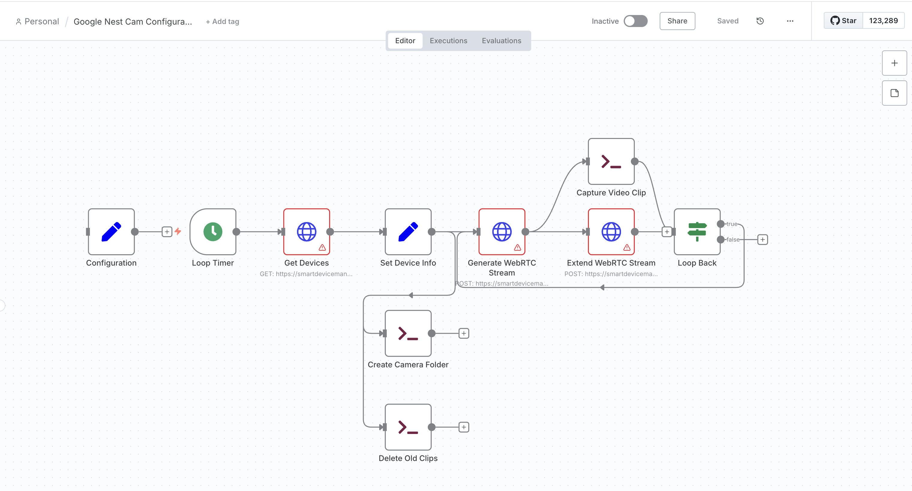

# n8n Google Nest Cam Configurable Record Template

This n8n workflow captures video clips from a single Google Nest Cam (wired) using the Google Smart Device Management (SDM) API, saving them locally in a folder named after the camera. Users can configure the clip interval (30 seconds to 5 minutes) and storage duration. Compatible with macOS, Linux, and Windows.

## Screenshot


## Features
- Captures video clips from a Google Nest Cam (wired) at user-defined intervals (default: 30 seconds).
- Stores clips locally in MP4 format with timestamps (e.g., `video_20250725_101130.mp4`).
- Deletes clips older than a specified number of days (default: 7).
- Supports OAuth 2.0 authentication for secure API access.
- Configurable storage path and clip duration.

## Prerequisites
- **n8n**: Version 1.50.0+ installed locally (via npm or Docker) or on n8n Cloud (https://n8n.io).
- **Google Cloud Project**:
  - Enrolled in Device Access program (US$5 fee): https://developers.google.com/nest/device-access
  - Smart Device Management API enabled.
  - OAuth 2.0 Client ID created.
- **Google Nest Cam (wired)**: Activated in the Google Home app and linked to a Google Cloud project.
- **FFmpeg**: Installed on the system running n8n.
- **Storage**: Writable directory with sufficient space (e.g., ~86 GB for 30 days of 30-second clips).

## Installation
### 1. Install Dependencies
- **n8n**:
  - npm:
    ```bash
    npm install n8n -g
    n8n start
    ```
  - Docker:
    ```bash
    docker run -p 5678:5678 -v ~/videos:/home/node/videos n8nio/n8n
    ```
  - Access at `http://localhost:5678` or use n8n Cloud.
- **FFmpeg**:
  - macOS:
    ```bash
    brew install ffmpeg
    ```
  - Ubuntu/Linux:
    ```bash
    sudo apt-get install ffmpeg
    ```
  - Windows: Download from https://ffmpeg.org/download.html and add to PATH.
  - Verify: `ffmpeg -version`
- **Storage Directory**:
  - macOS/Linux:
    ```bash
    mkdir -p ~/videos
    chmod 755 ~/videos
    ```
  - Windows: Create a folder (e.g., `C:\Videos`) and ensure write access.

### 2. Set Up Google Device Access
1. **Register for Device Access**:
   - Go to https://developers.google.com/nest/device-access.
   - Sign in with your Google account (or the camera owner’s account).
   - Enroll (US$5 fee) and create a project. Note the **Project ID**.
2. **Enable SDM API**:
   - In Google Cloud Console (https://console.cloud.google.com), select your project.
   - Go to **APIs & Services > Library**, search for “Smart Device Management API,” and enable it.
3. **Create OAuth 2.0 Credentials**:
   - Go to **APIs & Services > Credentials**.
   - Click **Create Credentials > OAuth 2.0 Client IDs**.
   - Set **Application type**: Web application.
   - Add **Authorized redirect URI**: `http://localhost:5678/auth/google/callback` (or your n8n instance URL).
   - Note the **Client ID** and **Client Secret**.
4. **Link Nest Cam**:
   - In Device Access Console, go to **Devices > Create Device**.
   - Link your Nest Cam (wired) via the Google Home app.
   - Verify the camera appears in the console.

### 3. Import the Workflow
1. **Download Workflow**:
   - Clone this repository:
     ```bash
     git clone https://github.com/yourusername/n8n-google-nest-cam-template.git
     ```
   - Or download `google-nest-cam-configurable-record.json` from the repository.
2. **Import to n8n**:
   - Open n8n (http://localhost:5678 or your instance).
   - Go to **Workflows > Import from File**.
   - Select `google-nest-cam-configurable-record.json`.

### 4. Configure the Workflow
1. **Set OAuth 2.0 Credential**:
   - In n8n, go to **Credentials > Add Credential > OAuth2 API**.
   - Configure:
     - **Name**: `Google SDM OAuth2`
     - **Grant Type**: Authorization Code
     - **Authorization URL**: `https://nestservices.google.com/partnerconnections/YOUR_PROJECT_ID/auth` (replace `YOUR_PROJECT_ID`)
     - **Access Token URL**: `https://oauth2.googleapis.com/token`
     - **Client ID**: From Google Cloud Console
     - **Client Secret**: From Google Cloud Console
     - **Scope**: `https://www.googleapis.com/auth/sdm.service`
     - **Access Type**: `offline`
     - **Prompt**: `consent`
   - Click **Connect**, sign in, and authorize.
   - Update the `Get Devices`, `Generate WebRTC Stream`, and `Extend WebRTC Stream` nodes to use this credential.
2. **Configure the `Configuration` Node**:
   - Open the `Configuration` node and set:
     - `projectId`: Your Google Cloud Project ID (e.g., `your-project-id-123456`).
     - `storagePath`:
       - macOS/Linux: `/Users/yourusername/videos` or `~/videos`
       - Windows: `C:\Videos`
     - `maxStorageDays`: Days to retain clips (e.g., `7`).
     - `clipInterval`: Clip duration/interval in seconds (30 to 300, default: `30`).
   - Example:
     ```json
     {
       "projectId": "your-project-id-123456",
       "storagePath": "/Users/yourusername/videos",
       "maxStorageDays": 7,
       "clipInterval": 30
     }
     ```
3. **Verify Camera**:
   - Run the `Get Devices` node to check the camera’s `customName` (e.g., `Living Room Cam`).
   - If you have multiple cameras, adjust `Set Device Info` to select a specific camera (e.g., `devices[1]`).

### 5. Test the Workflow
1. **Run Incrementally**:
   - **Get Devices**: Verify it lists your camera.
   - **Set Device Info**: Check `deviceId` and `cameraName`.
   - **Capture Video Clip**: Run the full workflow and check for clips in `storagePath/cameraName` (e.g., `~/videos/Living Room Cam/video_20250725_101130.mp4`).
2. **Troubleshooting**:
   - **Authentication Error**: Re-authenticate OAuth credential.
   - **FFmpeg Error**: Ensure FFmpeg is installed and in PATH.
   - **No Devices**: Verify Project ID and camera linkage.
   - **Permissions**: Ensure `storagePath` is writable (e.g., `chmod 755 ~/videos`).

### 6. Run the Workflow
- Activate the workflow (toggle “Active” in n8n).
- Clips are captured every `clipInterval` seconds and saved with timestamps.
- Clips older than `maxStorageDays` are deleted.
- Deactivate to stop.

## Notes
- **Storage**:
  - 30-second clips: ~7.5 MB each, ~86 GB for 30 days.
  - 5-minute clips: ~75 MB each, ~600 GB for 30 days.
  - `maxStorageDays: 7` reduces usage (e.g., ~20 GB for 30-second clips).
- **Performance**:
  - FFmpeg is CPU-intensive. Monitor with Activity Monitor (macOS), `htop` (Linux), or Task Manager (Windows).
  - Use a modern CPU (e.g., M1/M2 on macOS) for better performance.
- **API Limits**:
  - SDM API may have rate limits (https://developers.google.com/nest/device-access/api).
  - For 429 errors, add a `Wait` node (1 second) before `Generate WebRTC Stream`.
- **Multiple Cameras**:
  - Duplicate the workflow and modify `Set Device Info` to select `devices[1]`, `devices[2]`, etc.
  - Example for second camera:
    ```json
    "deviceId": "={{$node['Get Devices'].json.devices[1].name}}"
    "cameraName": "={{$node['Get Devices'].json.devices[1].traits['sdm.devices.traits.Info'].customName}}"
    ```
- **macOS Permissions**:
  - Grant n8n/FFmpeg disk access in **System Settings > Privacy & Security > Files and Folders**.
  - For Docker, share `~/videos` in Docker Desktop settings.

## Sharing Cameras
- To access another user’s camera (e.g., account B’s camera with account A):
  - Account B shares the camera in Google Home app (Settings > Household > Invite person).
  - Account B links the camera to a Google Cloud project and grants account A IAM permissions (e.g., Editor).
  - Account A uses account B’s Project ID and its own OAuth credential.

## API Reference
- Google Nest Cam (wired) API: https://developers.google.com/nest/device-access/api/camera-wired

## Contributing
- See [CONTRIBUTING](CONTRIBUTING)

## License
MIT License (see [LICENSE](LICENSE)).